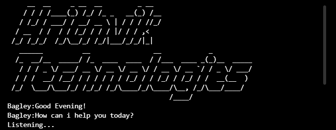

### Bagley AI 🤖!

Bagley is a **AI** 🤖 just like a google, alexa and siri!

[**Latest version**](https://github.com/Hrithvik-Technologies/Bagley-AI/releases/tag/v1.2)

## Installation ⚙️

1. Fork/Clone/Download this repo

    `git clone https://github.com/Hrithvik-Technologies/Bagley-AI.git`

2. Navigate to the directory

    `cd Bagley-AI`

3. run the Bagley.py script

    * `Bagley.py`
    * `python3 Bagley.py`

4. Install the following libraries in your system
    - 📌 pyttsx3 `pip install pyttsx3`!
    - 📌 SpeechRecognition `pip install SpeechRecognition`!
    - 📌 datetime `pip install datetime`!
    - 📌 wikipedia `pip install wikipedia`!
    - 📌 random `pip install ranodm`!
    - 📌 Pyaudio= in order to make your ai listen you you are gonna need pyaudio from [here](https://www.lfd.uci.edu/~gohlke/pythonlibs/). After downloading the file from here open cmd and cd the directory with `cd /yourdirectory` and type `pip install yourfilename.whl` to install it!

## Updating ⬇️

To update Bagley with the stable release just pull the latest commit using Git.

Download the latest version: `git pull origin main`
